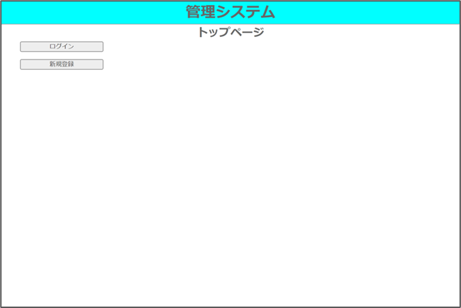
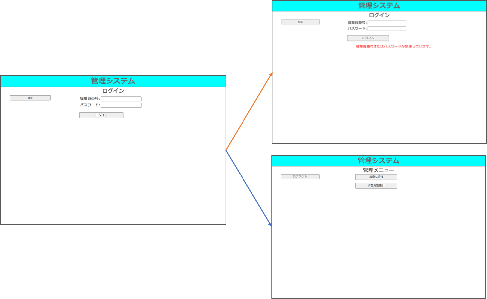
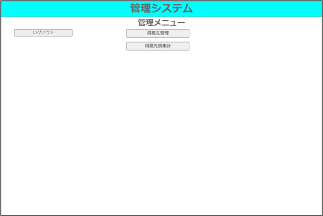
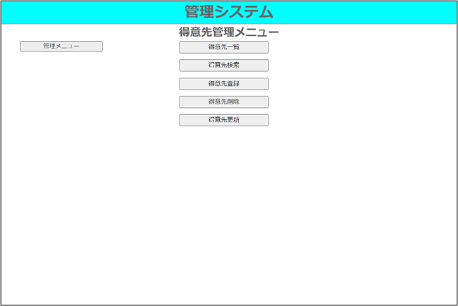
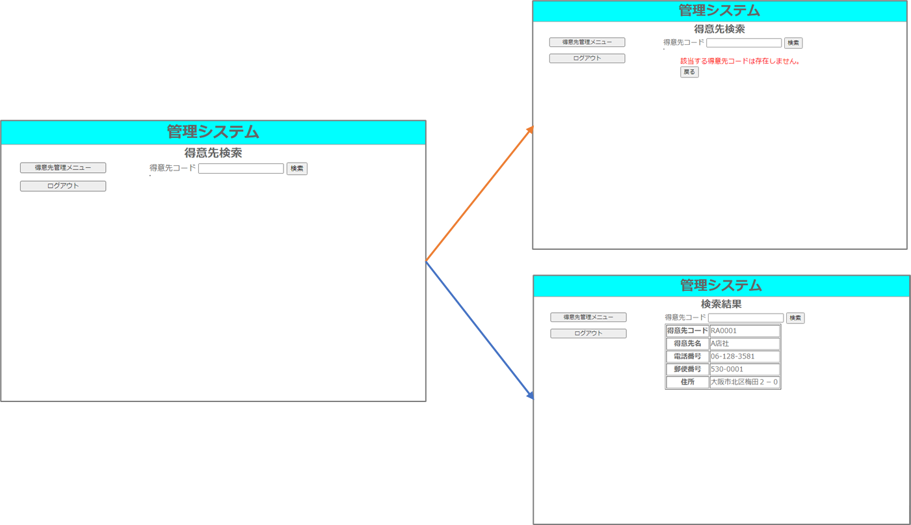

# (1) 設計書（ver.1）を基に「得意先検索機能」をプロトタイプとして開発
## 確認事項
1. お客様の要求は得意先検索機能をプロトタイプとして開発なので、設計書（P2）の開発範囲のようにトップ、ログイン、管理メニュー、得意先管理メニュー、得意先検索、検索結果の画面と機能です。

2. 設計書（P2，3）の画面遷移図と画面仕様図(P10,11)より、最初のアクセスはトップ画面（index.html）で"ログイン"ボタンのクリックでログイン画面（Login.html）に遷移できます。また、"top"ボタンでトップ画面に戻れます。

3. ログインは設計書（P3,11,12）より、入力されたemployee_noとpasswordがpsysdbのEmployeeテーブルに存在するレコードと一致すれば管理メニュー画面(MaineMenuhtml)に遷移させます。一致するものが無ければ、エラーメッセージ（messages.error）をログイン画面に表示させます。

4. 管理メニューから得意先管理メニュー(CustomerManagementMenu.html)、得意先別集計、ログアウト(index.html)にボタンで遷移できます。

5. 得意先管理メニューからは得意先一覧、得意先登録、得意先検索(CustomerSearch.html)、得意先更新、得意先削除に遷移できます。また、管理メニューに戻れます。

6. 得意先検索は入力された得意先コード(customer_code)がCustomerテーブルに存在すればレコードを取得して各項目を表示します。なければ、エラーメッセージ（messages.error）を表示します。

7. 設計書にはview.pyにindex.py()やlogin()の記述があるので関数ベースドビューで、書いていきます。

新たにページを作るときは、以下３つの作業が必要です。
1. URL設定　（urls.py）
2. View設定　(views.py)
3. Template設定 (html)	

### 手順1. django_projectディレクトリ内のurls.pyを下記のように編集します。
| django_project/urls.py  

psys/ 以下で示されるURLと、これから作成するpsysディレクトリ内のurls.pyを紐付けています。つまりpsys/ 以下が、psysアプリケーションとして機能するよう設定しています。

### 手順2. まずはトップ画面のURLを設定します。	
| psys/urls.py  

アプリケーションとして作成したpsysディレクトリ内のurls.pyを作成し、下記のように編集します。
psys/ のURLにアクセスすると、同ディレクトリ上にあるviews.py内のindex関数が呼び出されるように記述しています。
psys/Loginの場合はviews.py内のLogin関数が呼び出されます。

### 手順3. 次にトップ画面のViewを設定します。psysディレクトリ内のviews.pyを編集します。	
| psys/views.py  

render時にテンプレートに渡す値を変数pramsに設定します。
ブラウザのタブに表示させるtitleを”index”と画面内のページ名sub_titleを”トップページ”に設定します。

### 手順4. トップ画面のTemplateを設定します。	
| psys/templates/psys/index.html  
| css:psys\static\psys\css\style.css  



psys/templates/psysフォルダを作成しここにindex.htmlを作成します。  
styleはpsys/static/psys/css/style.cssを参考

```html:psys/templates/psys/index.html 参考
<!doctype html>						
<html>						
<head>						
    <meta charset="utf-8">						
    <title>管理システム | {{ title }}<title>						
    <link rel="stylesheet" type="text/css" href=""/>						
</head>						
<body>						
    <header>						
        <h1>管理システム</h1>						
        <hr>						
    </header>						
    <main>						
        <div>						
            <h2 id="contens_title">{{ sub_title }}</h2>						
        </div>						
        <div id="contents">						
            <div id="navi">						
                <ul>						
                    <li><a href="">ログイン</a></li>						
                    <li><a href="">新規登録</a></li>						
                </ul>						
            </div>						
        </div><!-- /contents -->						
    </main>												
</body>						
</html>						
```

```css:psys\static\psys\css\style.css 参考
* {
    margin: 0;
    }

body {
    color: #666;
    font-size: 1rem;
    }

header {
    background-color: aqua;
    }

main {
    background-color: white;
    }

ul li {
    list-style-type: none;
    }

#contens_title {
    text-align: center;
    }

#contents {
    width: 100%;
    display: flex;
    justify-content: flex-start;
    }

#navi {
    width: 35%;
    }

#main_contens {
    width: 65%;
    }

h1 {
    margin: 0;
    text-align: center;
    font-size: 2rem;
    }

#navi li {
    text-align: center;
    width: 11rem;
    margin-bottom: 1rem;
    background-color: #eee;
    border: #666 1px solid;
    border-radius: 3px;
    }

#navi li:hover {
    background-color: #ddd;
    }

#navi li a {
    font-size: small;
    display: block;
    text-decoration: none;
    color: #333;
    }

.btn {
    width: 12rem;
    margin-bottom: 1em;
    }

table {
    margin-bottom: 1rem;
    }

#message {
    color: red;
    }
```

ブラウザのタブに”管理システム | index”と表示されます。	
画面上部中央に"トップページ”と表示されます。  
ログインボタンはLogin.htmlに遷移するようにを設定します。  
これで後で記述するpsys/urls.py内urlpatternsの'Login'が設定されたpathが参照されて遷移します。	

### 手順5. 次はログインページです。views.pyに下記Login()を追記します。
| psys/views.py  
|　　Login()

変数pramsはindexと同様です。
request.method == "POST"の結果はブール値です。  
ユーザーからの現在の要求がHTTP "POST"メソッドを使用して実行された場合はTrue、そうでない場合はFalse  
Trueつまり後で作成するLogin.htmlでPOSTの送信があれば、入力された'employee_no'と'password'をrequest.POSTで取得し  
変数noとpasswordに代入、さらにEmployee.objects.get(employee_no=no, password=password)で取得しuserに代入します。

次にif user: がTrue、つまりEmployeeテーブルに一致するレコードがあればreturn redirect('/psys/MainMenu')で管理メニューに遷移させます。

取得できなければえらーになるのでexcept:のmessages.error（）でこのLoginページでエラーメッセージを表示させます。

### 手順6. ログイン画面を作ります	
| psys/templates/psys/Login.html  



\<input type="password" name="password">、\<input type="password" name="password">で入力された内容が  
\<form action="" method="POST">によってviews.pyのLogin()に渡されて処理されるようにします。

### 手順7. 次は管理メニュー画面です。views.pyに下記MainMenu()を追記します。	
| psys/views.py  
|　　MainMenu()

if '*****' in request.POST:で押されたボタンによって画面遷移先を変えます。

### 手順8. 管理メニュー画面を作ります	
| psys/templates/psys/MainMenu.html  



ログアウトはログイン画面に遷移させておきます。

### 手順9. 得意先管理メニュー画面です。views.pyに下記CustomerManagementMenu()を追記します。	
| psys/views.py  
|　　CustomerManagementMenu()

ここは管理メニュー画面と同様です

### 手順10. 得意先管理メニュー画面を作ります
| psys/templates/psys/CustomerManagementMenu.html  


これも管理メニュー画面と同様です。

### 手順11. 得意先検索画面です。views.pyに下記CustomerSearchを追記します。	
| psys/views.py  
|　　CustomerSearch()

入力された得意先コード'codeが' Customerテーブルのcustomer_codeと一致するレコードをCustomer.objects.get(customer_code=code) で抽出します。  
抽出結果は変数pramsに新しいtitleとsub_titleとともに代入しrenderで表示させます。  
取得出来ない場合はエラーになるのでexcept:によりエラーメッセージを表示されます。

### 手順12. 得意先検索画面を作ります	
| psys/templates/psys/CustomerSearch.html  



で得意先の情報を取り出して{{item.customer_code}}で表示させています。


