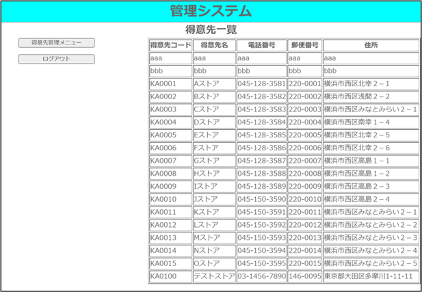
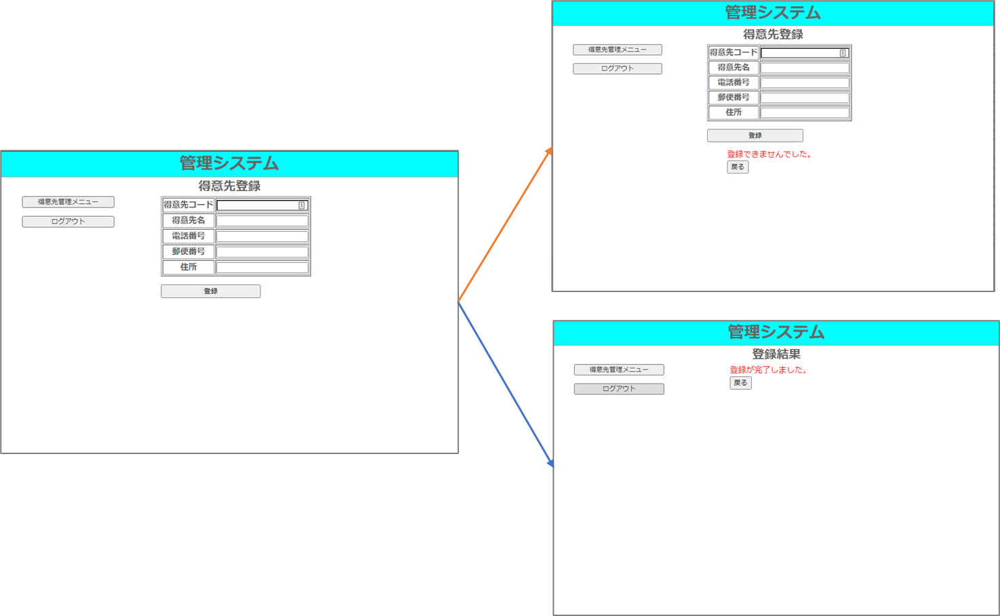
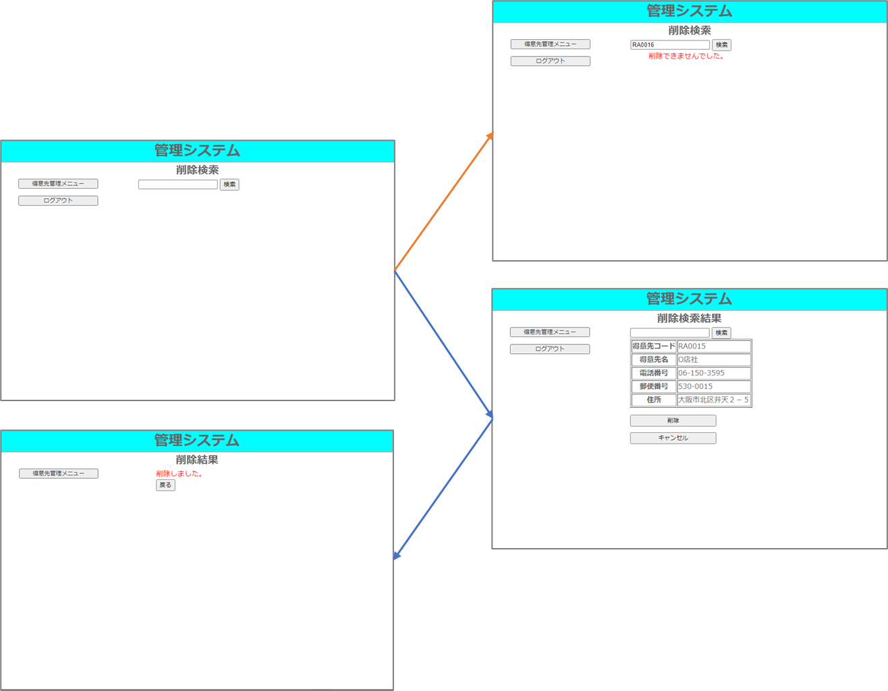

# （２）設計書（ver.2）を基に「得意先管理システム」をプロトタイプ開発	
## 確認事項
1. （１）の続きで残りの得意先管理システムをプロトタイプとして開発します。
    設計書（P2）の開発範囲のように得意先一覧、得意先登録、得意先更新、得意先削除とその各結果画面と機能です。
2. （１）で開発した得意先検索と同様に管理メニューから各画面に遷移させます。
3. 得意先一覧は画面仕様図(P14)より出力項目のみなので遷移時に一覧を表示させます。
    画面遷移図(P5)よりデータがない場合はmessage.errorを返します。
    
### 手順1．psysディレクトリ内urls.pyのurlpatternsに下記を追加します。	
| psys/urls.py
|　　urlpatterns
views.pyのCustomerDeleteResultを呼び出し、codeのデータを渡す
        
### 手順2.得意先一覧画面のViewを設定します。psysディレクトリ内のviews.pyに追記します。	
| psys/views.py  
|　　CustomerList()

### 手順3.得意先一覧画面のTemplateを設定します。	
| psys/templates/psys/CustomerList.html

得意先検索の結果画面と同じようにで得意先の情報を取り出して{{item.customer_code}}で表示させています。
表示は横方向に変わっています。１行に1件の表示ですべての得意先を表示しています。
        
### 手順4.得意先登録画面のViewを設定します。psysディレクトリ内のviews.pyに追記します。
| psys/views.py  
|　　CustomerRegist()

post送信にregistがあれば登録処理、customer_codeなどを変数に代入していきcustomerインスタンスを生成し保存
            
### 手順5.得意先登録画面のTemplateを設定します。	
psys/templates/psys/CustomerRegist.html

   
### 手順6.削除検索画面のViewを設定します。psysディレクトリ内のviews.pyに追記します。	
| psys/views.py  
|　　CustomerDelet()  
|　　CustomerDeleteResult()

CustomerDeleteResult(request, code)でcodeのデータをurls.pyより受け取る
        
### 手順7.削除検索画面のTemplateを設定します。
| html:psys/templates/psys/CustomerDelete.html

    
### 手順8.削除検索結果画面のTemplateを設定します。
| psys/templates/psys/CustomerDeleteResult.html

### 手順9.得意先更新画面のViewを設定します。psysディレクトリ内のviews.pyに追記します。
| psys/views.py  
|　　CustomerUpdate()  
|　　CustomerUpdateResult()  

### 手順10.更新検索画面のTemplateを設定します。	
| psys/templates/psys/CustomerUpdate.html

### 手順11.更新結果画面のTemplateを設定します。
| psys/templates/psys/CustomerUpdateResult.html
