## （８）従業員の新規登録機能を追加 		
        
業務用アプリでのユーザー登録等のアカウントの操作は限られた管理者によって行われており、		
一般ユーザーは登録内容の修正でも管理者への申請が必要になることがほとんどです。		
Djangoでは管理画面(/admin.html)にsuperuserでログインし操作することになります。		
今回はWebアプリを想定してサイトを訪れたユーザーが登録や各種変更を行えるようにしてみましょう。		
内容は以下の通りです		
1. Userモデルのカスタマイズ		
2. ログイン画面		
3. ユーザー登録		
4. マイページ		
5. パスワード変更、パスワード忘れ		
6. メールアドレスの変更		
7. 得意先管理システムを移植、その他のテーブルの作成

* サンプルコードは下記のように変更しています。
  * プロジェクト名：django_project_new  
  * アプリ名：accounts,psys_new  
  * データベース名：psysdb_new  		
        
     
#### Userモデルのカスタマイズ・ユーザーカスタマイズの２つの方法		
ユーザーのカスタマイズには大きく分けて二つの方法があります。１つは既存のユーザーモデルの拡張です。		
例えばプロフィールモデルなどをユーザーのIDとリレーションさせた１対１関係のモデルを用意することで既存ユーザーにない情報を付与することができます。		
もう一方は独自のユーザーモデルを構築する方法です。この方法の中でもAbstructUserを継承したユーザーモデルを使用する方法と、	AbstructBaseUserを継承したユーザーモデルを構築する方法があります。AbstructBaseUserを継承したモデルのほうがカスタマイズ性が高く融通がききます。		
今回はAbstructBaseUserを継承した独自ユーザー（employee）を作成していきます。		
        
#### データベースの初期化（すでにmigrateしている場合は、DBを初期化してmakemigrationsし直します）		
カスタムUserを使うには、Djangoプロジェクト開始時に設定しましょう。migrationsのinit(0001)以降でカスタムUserを設定すると、DBの整合性が取れなくなりmigirateが失敗します。特に他のmodelからUserを参照している場合などには、途中から参照を変える事ができません。		
独自ユーザーモデルを使用する場合は最初のデータベースマイグレーションの前に行う必要があります。そうしないとユーザーに関連する多くのモデルがDjangoの既存ユーザーモデルとリレーションした状態でデータベースが構築されてしまうからです。		
        
#### 1.1　新しくプロジェクトを作り直しています		
既存のファイルは適時移植していきます

    django-admin startproject django_project_new .	

作成したプロジェクトフォルダをVSCodeで作業ディレクトリとして開きアプリを作成  

    python manage.py startapp accounts		
             
#### ■ データベースを作成(psysdb_new)		
下記は1.3のようにsettings.pyでデータベースの設定をした後にdbshellで作成してます。

    > python manage.py dbshell		
    mysql> create database psysdb_new;		
    mysql> use psysdb_new;		
                
#### 1.2　独自カスタマイズユーザーの実装		
models.pyを、以下のように変更します。 AbstractUserのソースコード（右記）を利用し、認証にはusernameの代わりにemployee_noを使うようにしています。		
| accounts/models.py  
|　　CustomUserManager(UserManager)  
|　　Employee(AbstractBaseUser, PermissionsMixin)  

※ 共通のユーザー設定	
※ 与えられた従業員番号、パスワードでユーザーを作成して保存する関数  	
※ employee_noに値がない場合、例外メッセージを表示。raiseは、意図的に例外を発生さる  
※ そのユーザーのユニークなキーを記述。ここではusernameの代わりにemployee_noとします。  	

#### ■ ソースコードの解説
UserManagerクラスは、ユーザ名、メールアドレス、パスワードに関するメソッドを提供するBaseUserManagerを継承します。	
      
この_create_user、create_user、create_superuserの３つがUSER作成の時に使われるもので	
_create_userがUSERを作る部分ほか２つは値の固定値をセットしているだけでセットした値を使って_create_userを呼び出しているだけでです。	
そのため、SUPERUSERほどの権限はないが一般ユーザーよりはできることがあるUSERを独自に設定しする場合もここにメゾットを追加してそれを呼び出すようにすれば作成が可能です。　　
また、AbstructBaseUSERを利用する場合は、これらをセットで呼び出すため、USERNAMEがいらなくなった時は、USERを作成する_create_userが

    if not employee_no:	
        raise ValueError('The given employee_no must be set')	

とあるようにemployee_noが必須状態になっており、ない場合はエラーが発生するように仕込まれています。　　
そのため、employee_noを消してemail必須でログインするなら

    if not email:	
        raise ValueError('The given email must be set')	

のように変更しないといけません。	
よって、カスタムユーザーを変更するにはこのUserManagerも必須になるわけです。	

次に、  
emailフィールドは、テーブル上で一意（unique=True）となる制約を受けます。		

次に、         
標準のBaseUserManagerを使う代わりに、UserManagerを使うということをDjangoに知らせています。 		
これにより、今後「create_user」、「create_superuser」のメソッドを呼ぶときに		
UserManagerクラスの「create_user」、「create_superuser」のメソッドが呼ばれるようになります。		
        
ユーザーを作成するために必要なキーを記述します。		
「createsuperuser management」コマンドを使用してユーザーを作成するとき、		
プロンプ​​トに表示されるフィールド名のリストです。		
デフォルトは「REQUIRED_FIELDS = [‘username’]」です。		
        
full_name、short_nameは今回使用しません		
        
### 1.3　自分で作ったUserモデルをデフォルトで使用するため宣言します。	
| settings.py  
|　　DATABASE  

settings.pyに、以下を付け加えます。
データベース名も書き換えます。  

自作のログイン画面等を使う場合はこれだけで問題ありません。  	
しかし、デフォルトの管理画面（/admin）でこのカスタムユーザーを使う場合は、admin.pyへ処理を加える必要があります。  	
元々のUserモデルが使っていたusernameをemployee_noに置き換えます。また、使用しているFormもカスタムユーザーに合わせたものにします。  	

| accounts/admin.py  
|　　MyUserChangeForm()
|　　MyUserCreationForm()  
|　　MyUserAdmin()  

        
### 1.4　マイグレート	
1.マイグレーションファイルを作成します。
```
python manage.py makemigrations	
```
2.マイグレートします。
```
python manage.py migrate	
```
3.スーパーユーザを作ります。
```
python manage.py createsuperuser	
```
以下のようなプロンプトが表示されます。従業員番号、パスワード、パスワード確認を入力します。	
デフォルトではUsernameの入力が求められましたが、「従業員番号」が最初の入力になっています。

    従業員番号: 	
    Password: 	
    Password (again): 	
    Superuser created successfully.	
    http://ローカルホストのipドレス:8000/admin/で確認してみましょう	
    

## 2.ログインページの設定	
    
### 2.1　settings.pyを編集します。ログイン画面を何処にするかの設定と、ログインした後のリダイレクト先の設定を書きます。

reverse関数に渡せるような形で、文字列として定義することができます。
ログイン必須にするviewに、クラスベースには「LoginRequiredMixin」を継承、ファンクションベースには「@login_required」デコレータを記述します 
LOGIN_URL = 'accounts:Login'	
LOGIN_REDIRECT_URL = 'psys_new:MainMenu'	
    
### 2.2　URL定義	
| django_project_new/urls.py  
|　　urlpatterns　　

| accounts/urls.py  
|　　urlpatterns


### 2.3　ログイン用フォームの作成	
forms.pyです。ログイン用のフォームを作成し、Bootstrap4対応させます。 	
今回はラベルを使わず、placeholder内にラベルを表示させる方法を使います。 カスタムユーザーでもデフォルトユーザーでも、問わず使えます。	
| accounts/forms.py  


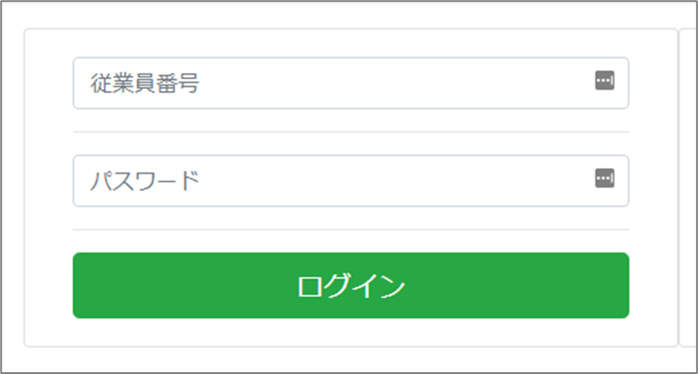
    

### 2.4　ログイン・ログアウトビューおよびメインメニュービュー	
| accounts/views.py  
|　　class Top(generic.TemplateView):  
|　　class Login(LoginView):  
|　　class Logout(LogoutView):  
|　　class MainMenu(LoginRequiredMixin, generic.TemplateView):  


### 2.5　ベーステンプレートの作成	
| templates/base.html  


### 2.6　トップページ
| templates/accounts/top.html  

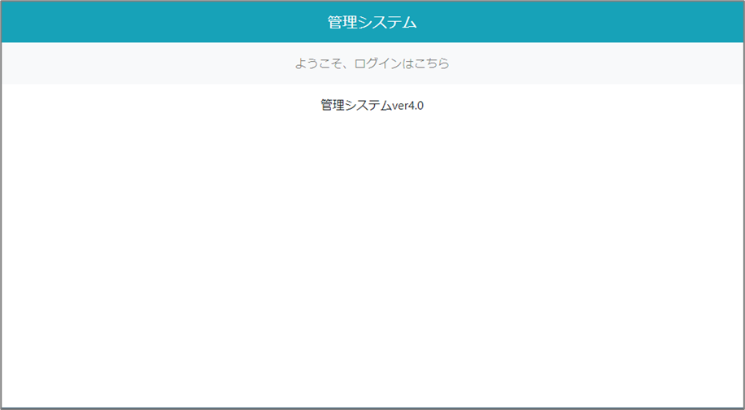


### 2.7　ログインページ
|  templates/accounts/Login.html  

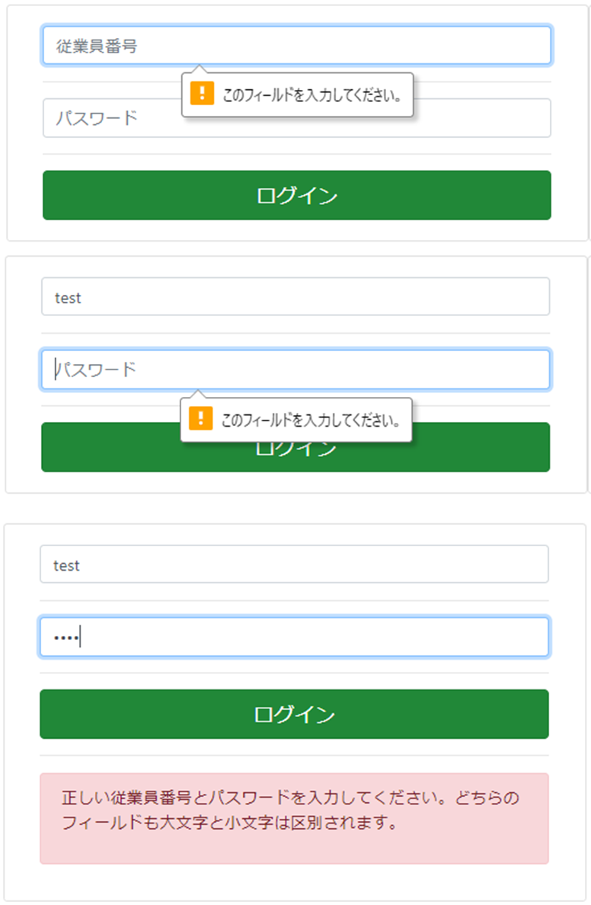

### 2.8　メインメニューページ	
| templates/psys_new/MainMenu.html  
これ以降のリンク（得意先管理など）はひとまずこのページに遷移させておきます。
    

## 3.ユーザー登録ページとメールでのアクティベーション	
### 3.1　メールの設定	
| settings.py

メールで本登録用のURLを送付します。今回は、メール内容をコンソールに表示することにします。  

### 3.2　URL定義の追加	
| accounts/urls.py

### 3.3　ビューの追加
| accounts/views.py
|　　class UserCreate(generic.CreateView):
|　　class UserCreateDone(generic.TemplateView):
|　　class UserCreateComplete(generic.TemplateView):

#### ■ ソースコードの解説
get_user_model関数は、そのプロジェクトで使用しているUserモデルを取得します。	
つまりデフォルトのUserか、カスタムしたUserが帰ります。	
汎用的な処理が書けるようになりますので、ユーザーをインポートするときはget_user_model関数を使うようにしましょう。	    
    
まず、is_active=Falseにすることで仮登録にします(デフォルトはTrueの設定)。	
    
django.core.signing.dumpを使うことで、tokenを生成しています。	
これはsettings.pyのSECRET_KEYの値等から生成される文字列で、第三者が推測しずらい文字列です。	
この文字列をもとに、本登録用のURLを作成し、そのURLをメールで伝えるという流れです。	
    
UserCreateDoneビューは仮登録したと表示するだけのものです。	
    
本登録用のURLでアクセスしたきた人を検証するビューです。	
    
アクティベーションURLの期限は、settings.pyにてACTIVATION_TIMEOUT_SECONDS = 60*60*24等と書いてもいいですし、	
timeout_seconds属性を書き換えてても動作します。 60*60*24は、1分×60×24 の一日です。	
    
django.core.signing.dumps(user.pk)として作成したトークンは、	
django.core.signing.loads(token)としてuserのpkに復号化できます。 max_ageで有効期限の設定が可能です。	
    
SignatureExpired例外は期限切れ、デフォルトならば1日過ぎてからアクティベーションリンクを踏んだということです。	
BadSignatureは、そもそもトークンを適当に入力していたりする場合です。	
    
問題なければis_active=Trueで本登録とします。	


### 3.4　ユーザー登録フォームの作成	
| accounts/forms.py  
|　　class LoginForm(AuthenticationForm)  
|　　class UserCreateForm(UserCreationForm)  

仮登録をしたけど本登録を忘れていて、アクティベーションリンクの期限を超えた場合や、	
メールアドレスの入力間違いなどがあって、自分のメールアドレスが仮登録済みの場合もあり得ます。	
その際はもう一度会員登録をするはずですが、「このメールアドレスは使われています」と表示されて登録ができないと良くありません。	
そこで、clean_email()メソッドは同じメールアドレスで仮登録段階のアカウントを消去しています。	


### 3.5　メールのテンプレートファイル	
accounts/mail_template/create/subject.txt として、仮登録メールで使う題名となるテンプレートファイルを作成しておきます。
mail_templateのように専用のディレクトリを作っておくとわかりやすいです。

1	ユーザー登録    
accounts/mail_template/create/message.txtとして、メールの本文となるテンプレートファイルも作っておきます。

```
{{ user.employee_name }} 様 ユーザー登録手続きを行っていただき、ありがとうございます。
	
下記URLよりサイトにアクセスの上、引き続きユーザー登録をお願いいたします。
まだ会員登録手続きは完了しておりませんので、ご注意ください。

本登録用URL
{{ protocol}}://{{ domain }}

管理システム
```

### 3.6　ログインテンプレートの編集
| templates/accounts/Login.html  

右側に会員登録リンクを増やしています

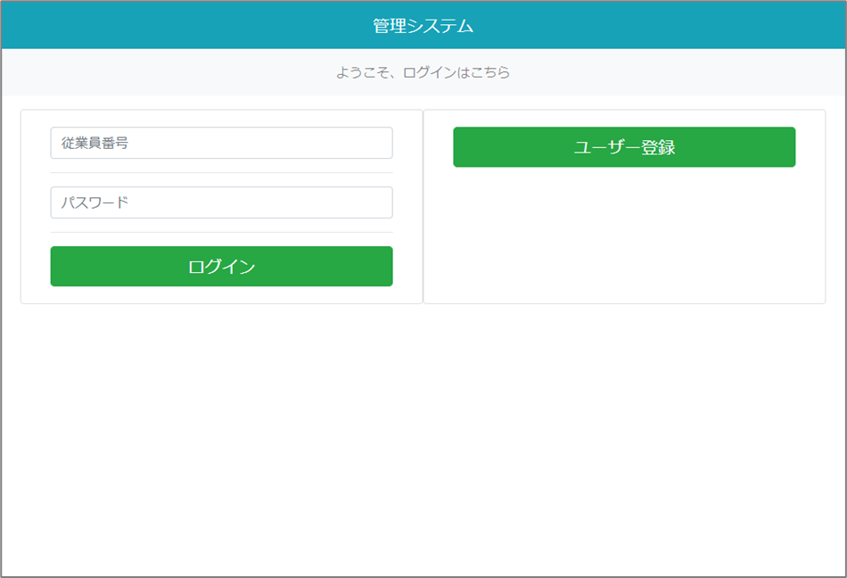


### 3.7　ユーザー登録テンプレートの作成	

■ ユーザー登録ページ
| psys_new/templates/psys_new/user_create.html  

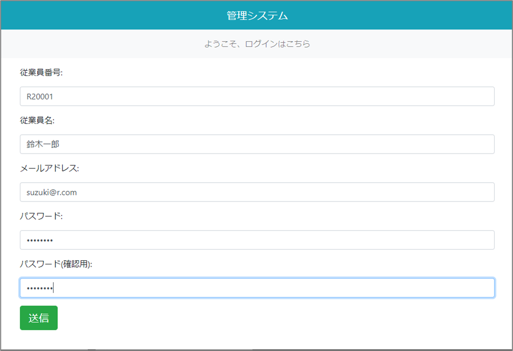


■ 仮登録通知ページ
| psys_new/templates/psys_new/user_create_done.html  

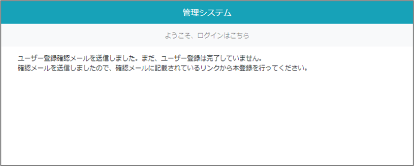

■ 本登録完了ページ

実際にユーザー登録してみましょう
| psys_new/templates/psys_new/user_create_complte.html  

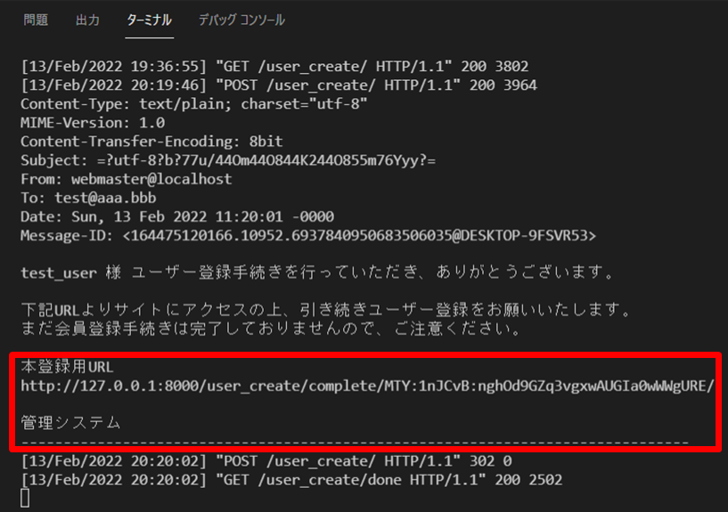

■ テストユーザー

    従業員番号,従業員名,メールアドレス,パスワード	
    R20001　鈴木一郎　suzuki@r.com　su202201	
    R20002　山田太郎　yamada@r.com　sa202202	
    R20003　坂本竜馬　sakamoto@r.com　sa202203	
    R20004　田中花　tanaka@r.com　ta202204	
   
    
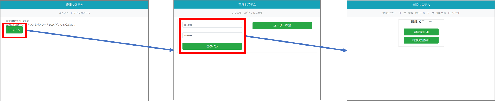
    
## 4.　ユーザー情報閲覧・更新ページ	
    
### 4.1　URL定義の追加	
| accounts/urls.py  

### 4.2　ユーザー情報更新フォーム	
| psys_new/forms.py　　
|　　class UserUpdateForm(forms.ModelForm):

### 4.3　ビューの追加	
| accounts/views.py  
|　　class OnlyYouMixin(UserPassesTestMixin):
|　　class UserDetail(OnlyYouMixin, generic.DetailView):
|　　class UserUpdate(OnlyYouMixin, generic.UpdateView):

ユーザー情報閲覧・更新ページは、自分以外アクセスできないようにするのが良さそうです。	
こういった場合に使えるのがDjangoに用意されているUserPassesTestMixinです。	
クラス属性raise_exceptionは、条件を満たさない場合に403ページに移動させるかどうかのフラグです。	
Falseなら、ログインページに移動させます。 test_funcメソッド内に、条件となる処理を書くだけです。	

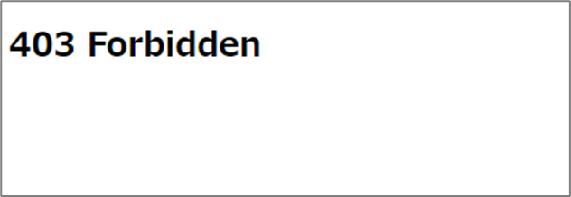

get_success_url()では、リダイレクト先のURLを文字列で返します。	
今回は更新した後に詳細ページに移動させたかったのですが、このようにリダイレクト先が	
動的に変わる場合はクラスの属性ではなく、メソッドを上書きします。	
    

### 4.4　ベーステンプレート更新	
| psys_new/templates/base.html  


### 4.5　ユーザー詳細テンプレート作成	
| templates/accounts/user_detail.html  

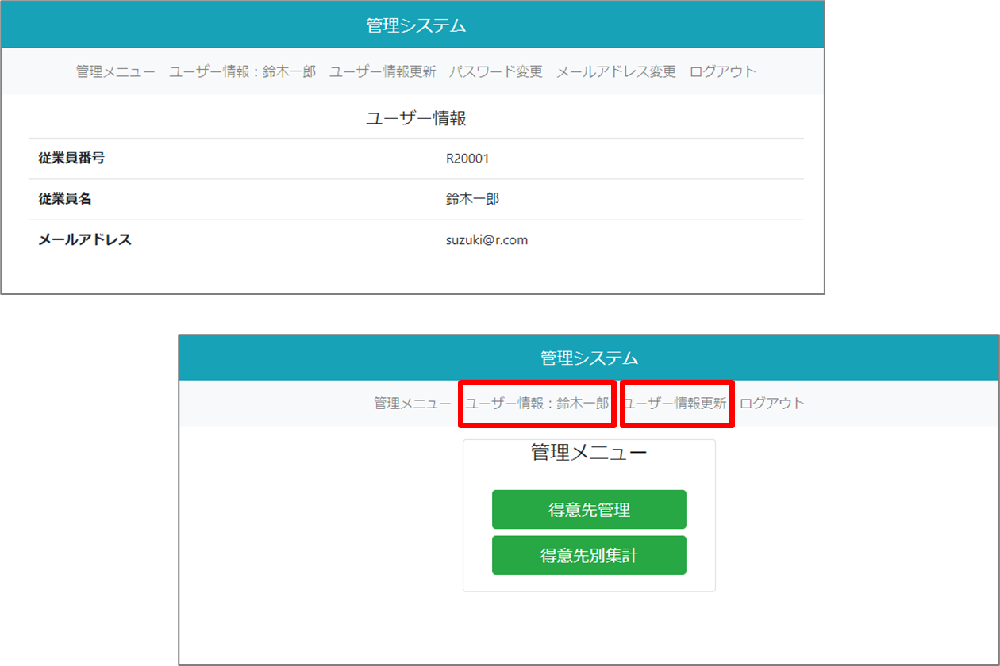


### 4.6　ユーザー情報更新テンプレート作成	
| templates/accounts/user_form.html  

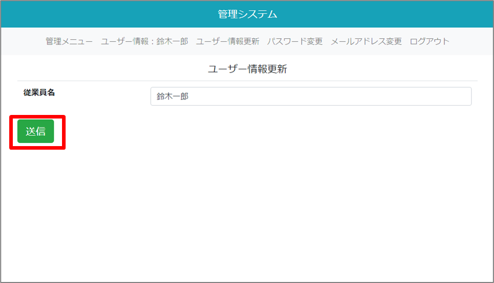


## 5.パスワード変更ページと再設定ページ	
    
### 5.1　URL定義の追加	
| psys_new/urls.py  

    
### 5.2　ベーステンプレート更新	
| templates/base.html  

    
### 5.3　ユーザー情報更新フォーム	
| accounts/forms.py  

    
### 5.4　ビューの追加	
| psys_new/views.py  
|　　class PasswordChange(PasswordChangeView)  
|　　class PasswordChangeDone(PasswordChangeDoneView)  


### 5.5　パスワード変更テンプレート	
| templates/accounts/password_change.html  

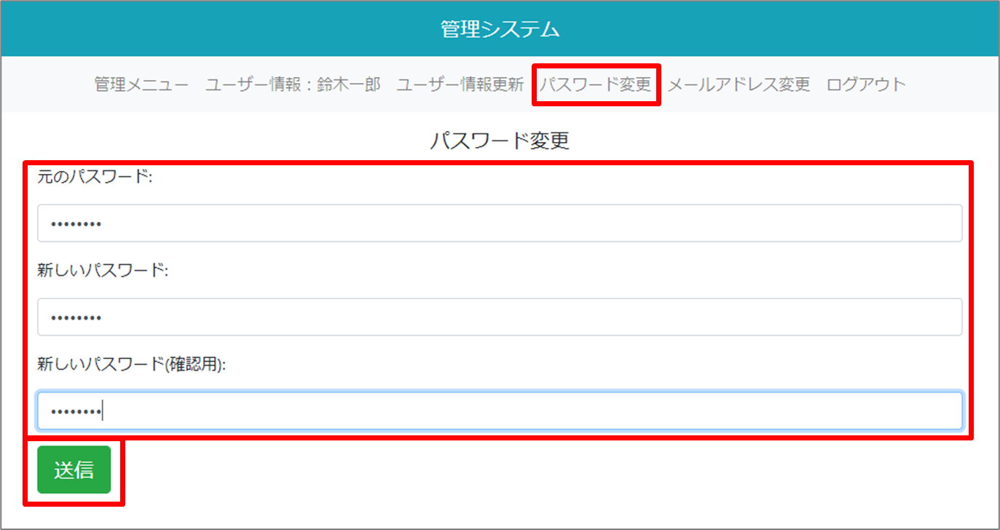


### 5.6　パスワード変更完了テンプレート	
| templates/accounts/password_change_done.html  

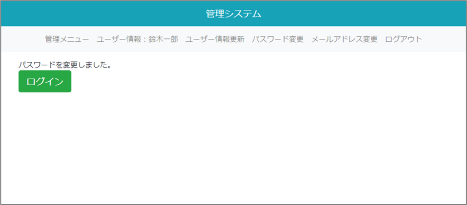


### 5.7　パスワード再設定のURL定義の追加	
| accounts/urls.py  


### 5.8　パスワード再設定フォーム	
| accounts/forms.py  
|　　class MyPasswordResetForm(PasswordResetForm)  
|　　class MySetPasswordForm(SetPasswordForm)  


### 5.9　ログインテンプレートの編集	
| templates/accounts/Login.html  

リンクを増やしています
    
### 5.10　ビューの追加	
| accounts/views.py  
|　　class PasswordReset(PasswordResetView)  
|　　class PasswordResetDone(PasswordResetDoneView)  
|　　class PasswordResetConfirm(PasswordResetConfirmView)  
|　　class PasswordResetComplete(PasswordResetCompleteView)  

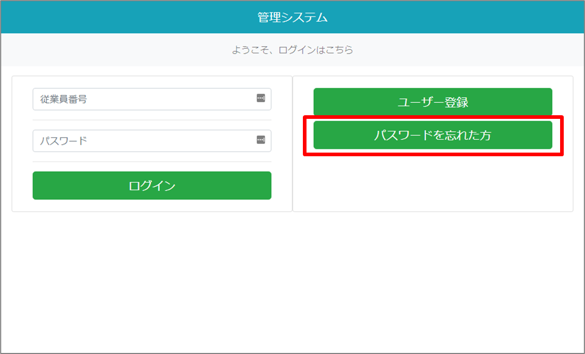

### 5.11　メール用テンプレートファイルを作成します。	

```txt:accounts/mail_template/password_reset/subject.txt
パスワードの再設定

accounts/mail_template/password_reset/message.txt
{{ user.employee_name }} 様

下記URLよりサイトにアクセスの上、パスワードの再設定を行ってください。

再設定用URL
{{ protocol}}://{{ domain }}

管理システム
```

### 5.12　パスワード変更テンプレート
| templates/accounts/password_reset_form.html  


### 5.13　パスワード再設定用のメールを送信したことを通知	
| templates/accounts/password_reset_done.html  

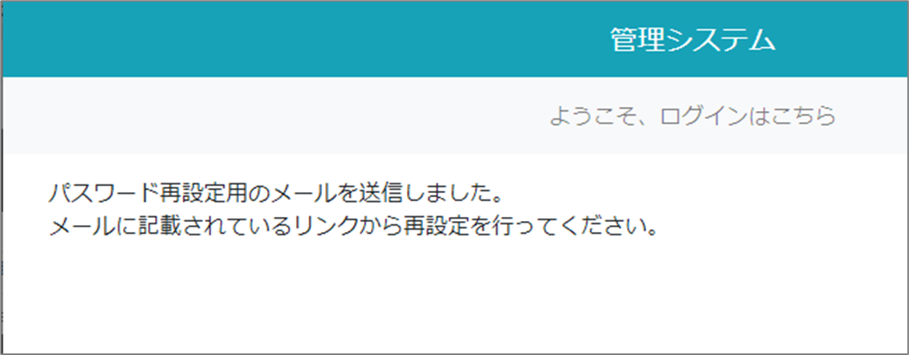

### 5.14　新しいパスワードを設定するページ	
| templates/accounts/password_reset_confirm.html  

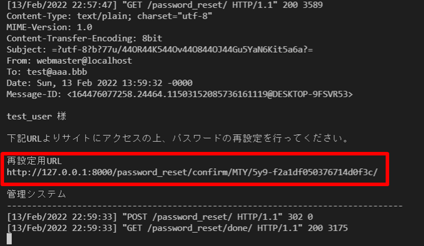

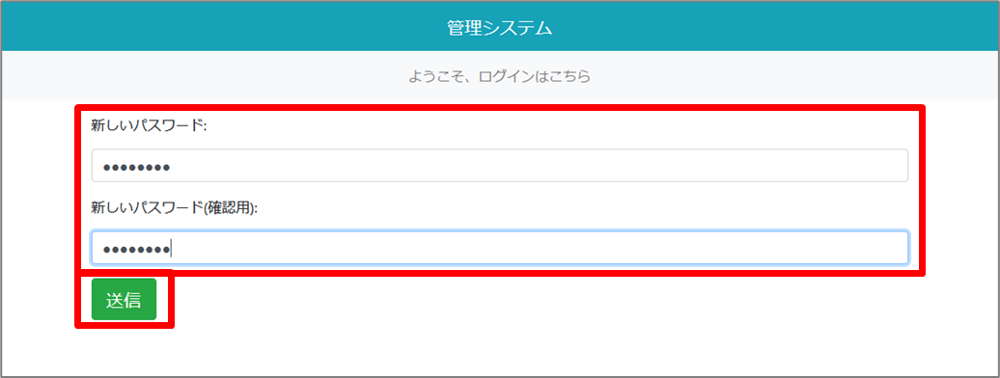

### 5.15　再設定完了
| templates/accounts/password_reset_complete.html  

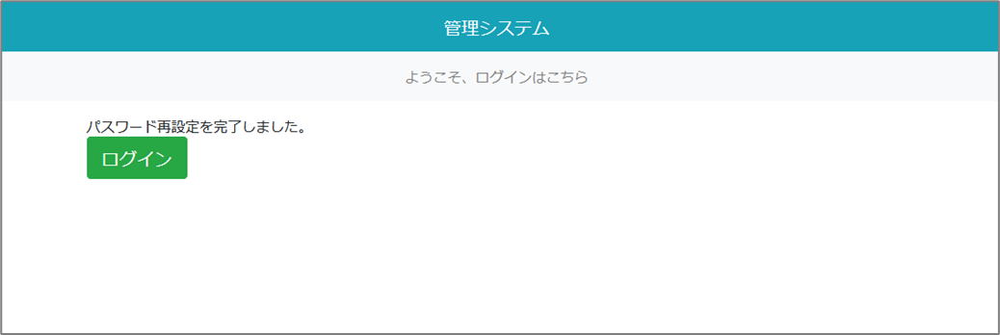

## 6.メールアドレス変更ページの作成	
    
### 6.1　URL定義の追加	
| accounts/urls.py  


### 6.2　ベーステンプレート更新　リンクの追加	
| templates/base.html  


### 6.3　メールアドレス変更フォーム	
| accounts/forms.py  
|　　class EmailChangeForm(forms.ModelForm)  

ユーザー登録時と同じように、clean_email()では仮登録状態で、	
同じメールアドレスのアカウントを削除しています。	

    
### 6.4　ビューの追加	
| accounts/views.py  
|　　class EmailChange(LoginRequiredMixin, generic.FormView)  
|　　class EmailChangeDone(LoginRequiredMixin, generic.TemplateView)  
|　　class EmailChangeComplete(LoginRequiredMixin, generic.TemplateView)  

EmailChangeビューはメールアドレスの変更ページで、送信ボタンが押されると、アドレス変更の確認メールを送ります。	
generic.FormViewを利用していることや、フォームのsave()メソッドを呼んでいないことに注意してください。	
EmailChangeFormはモデルフォームではありますが、それはモデルのunique=True等のチェックのために	
モデルフォームを利用しただけで、データを作成する必要はありません。	
    
EmailChangeCompleteはトークンの検証を行い、	
問題がなければ新しいメールアドレスに変更するビューです。	


### 6.5　メールアドレス変更入力テンプレート	
| templates/accounts/email_change_form.html  
    
### 6.6　メールアドレス変更のメールを送信したことを通知	
| templates/accounts/email_change_done.html  

    
### 6.7　メールアドレス変更完了ページ	
| templates/accounts/email_change_complete.html  


### 6.8　メール用テンプレートファイルを作成します。	
| accounts/mail_template/email_change/subject.txt  

メールアドレス変更

| accounts/mail_template/email_change/message.txt  

下記URLよりサイトにアクセスすると、メールアドレスの変更が完了します。

### 7.1　その他のテーブルの作成（customer_numbering、order_details、orders、customer、item）		
psys_new/models.pyに右記のclassを追加しマイグレーションします	
マイグレーションでフィールドの順番が入れ替わるのでマイグレーションファイルを修正します	
models.pyの記述と揃えないとデータ投入時（psysdb_new.sql）にカラムと値が合わずエラーになる	
マイグレートするとOrderDetailsにはプライマリーキーの設定がないので自動でidフィールドが作成されます	
OrderDetailsデータ投入sql（psysdb_new.sql）にはidの値を追加しています	
        
        
### 7.2　その他のテーブルの作成	得意先管理システムを移植していきます	
psysをpsys_newに書き換え等、サンプルコードではbootstrapに適応させています	
| models.py  
|　　class Customer(models.Model)  
|　　class CustomerNumbering(models.Model)  
|　　class Item(models.Model)  
|　　class OrderDetails(models.Model)  
|　　class Orders(models.Model)  

最後に各ページの動作を確認します	
