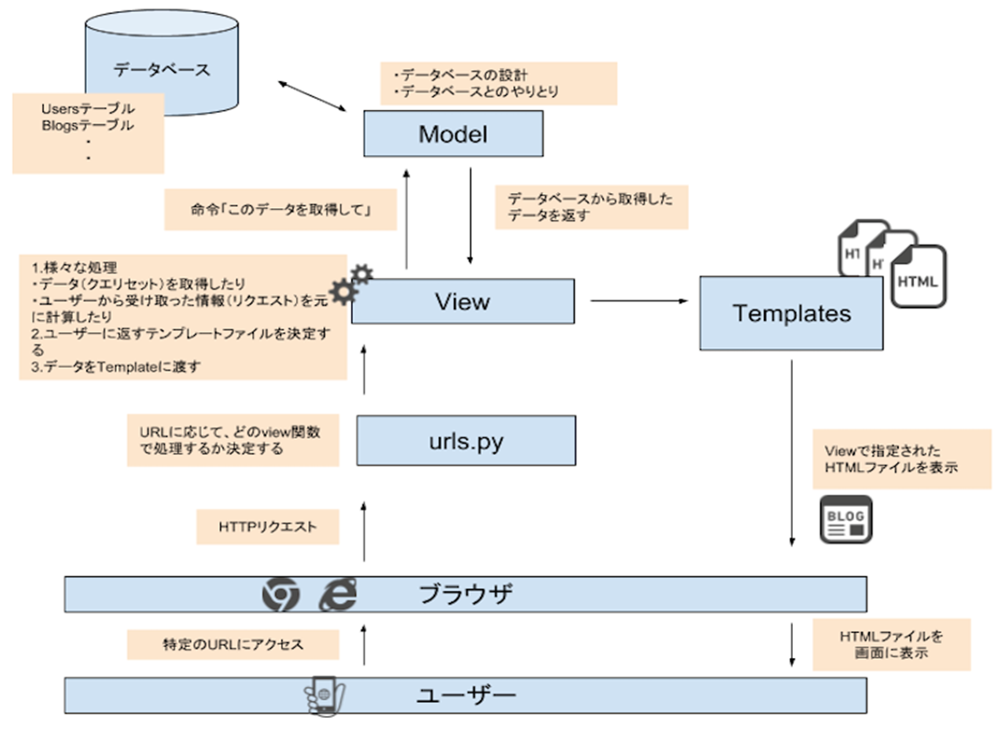
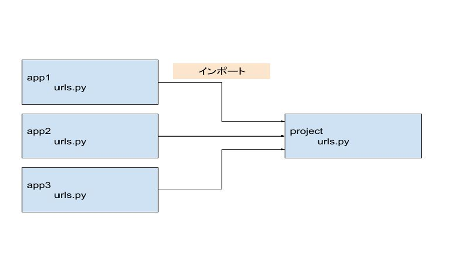

## MVT

新たにページを作るときは、以下３つの作業が必要です。
1.   URL設定　（urls.py）
2.   View設定　(views.py)
3.   Template設定 (html)

Djangoプロジェクトは主にModel、Templates、Viewによって構成されますが、このことをMTV構成と呼びます。

MTVのイメージ図は以下の通りです。


### URL設定

まずは、URLを設定しましょう。URLはプロジェクトディレクトリ（今回の場合は~/django_project/django_project）内のurls.pyで定義できます。
しかし通常は、アプリディレクトリ内にもう１つurls.pyファイルを作成し、これをインポートする方法を取ることが多いです。
また、複数のアプリを作成する場合はそれぞれのアプリごとにurls.pyを作成し、プロジェクトディレクトリのurls.pyでそれらをインポートします。



もちろん、urls.pyをアプリごとにに作らずに、プロジェクトディレクトリ内のurls.pyに全てのパスを記述しても正常に動作します。
ただ、たくさんのパス設定が必要になる大規模なプロジェクトなどでは、１つのurls.pyファイルに全て記述するよりも、
アプリごとに分割しておくことで可読性が高くなるなどのメリットがあります。
では、まずプロジェクトディレクトリ内のurls.pyファイルを編集しましょう。２行目でincludeをインポートすることを忘れないでください。

```python:urls.py
from django.contrib import admin
from django.urls import path, include

urlpatterns = [
    path('psys/', admin.site.urls),
    path('', include('psys.urls')),
]
```
この記述により、http://127.0.0.1:8000/psys/にアクセスされたときは、psysディレクトリ内のurls.pyファイルを参照することを定義しました。

続いては、psysディレクトリの中にurls.pyファイルを作成しましょう。作成したurls.pyファイルには以下のように記述してください。

```python:~/memo/app/urls.py
from django.urls import path
from . import views

app_name = 'psys'
urlpatterns = [
    path('', views.index, name='index')
]
```

これにより、http://127.0.0.1:8000/psys/のパスで、views.pyファイル内のindex関数が実行されることになりました。
当然、まだindex関数は作っていないので、今のままでアクセスしてもエラーになります。
path関数の第一引数はURLを指定しており、第二引数はそのURLに結びつけるviewを指定してます。
この場合、appの中のindexというview関数に紐づけています。
name引数はそれぞれのURLに名前を設定しており、他のviewから呼び出すときに利用できる名前になります。


### View設定
Viewは、views.pyファイルで定義します。下の記述で、psys/templates/psys/index.htmlを表示するようになります。

```python:views.py
from django.shortcuts import render

def index(request):
    return render(request, 'psys/index.html')
```

### Template設定
最後にTemplateファイル（HTML)を作りましょう。Viewで設定したように、psys/templates/app/index.htmlを作ります。

これで、/django_project/psys/templates/psys/index.htmlというフォルダ階層ができました。

どうしてtemplatesディレクトリの中にもう１つのディレクトリを作るのか？
上記では、memo/app/templates/app/index.htmlのように、templatesディレクトリ内にわざわざアプリ名と同名のディレクトリを作成して、その中にHTMLファイルを作っています。一見、memo/app/templates/index.htmlのようにしてもよさそうですが、どうしてこのようにしないのでしょうか。
views.pyファイルrender関数の第2引数では、表示するテンプレートファイルを指定していますよね。このとき、Djangoデフォルトの設定ではアプリ内のtemplatesディレクトリを自動で参照するようになっています。よって、'app/index.html'という書き方で、templates/app/index.htmlを指定していることになるのです。
フォルダ構成をmemo/app/templates/index.htmlのようにtemplates直下にindex.htmlファイルを置き、第2引数で'index.html'とする書き方もできます。
この方がシンプルで良さそうですが、この書き方だと、他のアプリ内にもindex.htmlがあった場合、意図しない結果となってしまうので望ましくありません。
例えば、以下のようにapp1とapp2という２つのアプリがあったとします。ここでは、それぞれがindex.htmlファイルという同名のファイルを保有しているとします。このとき、render(request, 'index.html')とすると、render関数は常にapp1内のtemplatesディレクトリを参照することになり、app2内のindex.htmlは指定できなくなります。
※仮にapp2の中にあるviews.pyでrender(request, 'index.html')と記述してもapp1のindex.htmlを参照します。これは、テンプレートファイルを参照するときに、上のtemplatesディレクトリから探していくという決まりがあるからです。

```
（悪い例）
app1/
    templates/
        index.html
app2/
    templates/
        index.html
```

この状況を防ぐために、あえてtemplates内にディレクトリを作ることで、同名ファイルがあっても明示的に指し示せるようにします。

```
（良い例）
app1/
    templates/
        app1/
            index.html
app2/
    templates/
        app2/
            index.html
```

このようにすれば、'app1/index.html'や'app2/index.html'のように記述でき、それぞれのアプリ内に同名ファイルがあっても大丈夫になります。
ちなみにですが、app内のtemplatesを自動的に参照するのは、settings.pyファイルの'APP_DIRS'が Trueになっているからです。

```python:~/memo/memo/settings.py
TEMPLATES = [
    {
        'BACKEND': 'django.template.backends.django.DjangoTemplates',
        'DIRS': [],
        'APP_DIRS': True,
        'OPTIONS': {
            'context_processors': [
                'django.template.context_processors.debug',
                'django.template.context_processors.request',
                'django.contrib.auth.context_processors.auth',
                'django.contrib.messages.context_processors.messages',
            ],
        },
    },
]
```    
