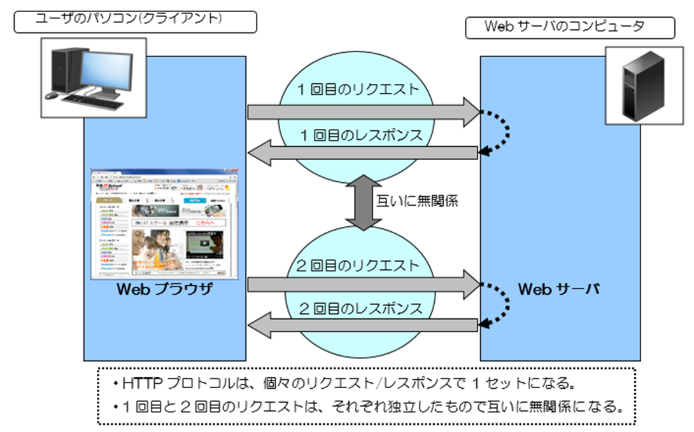
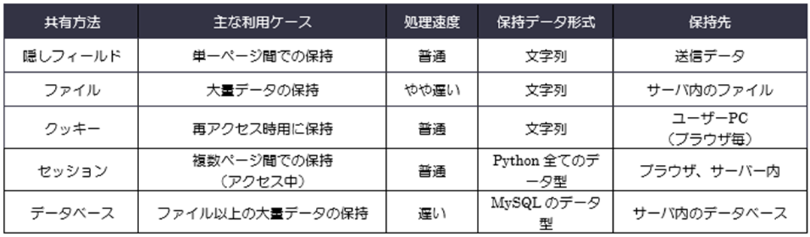
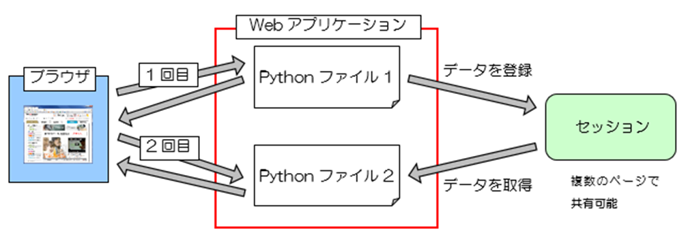
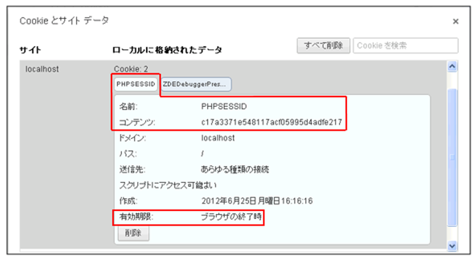
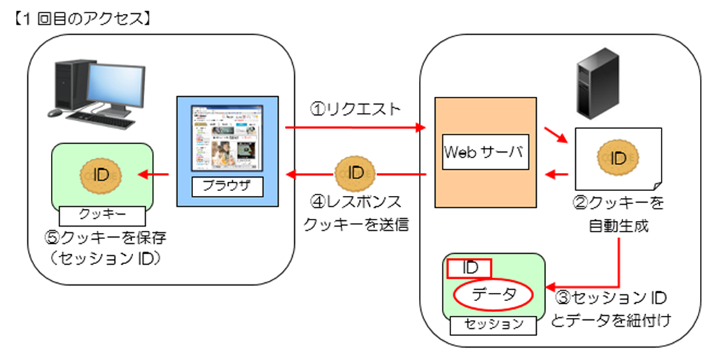
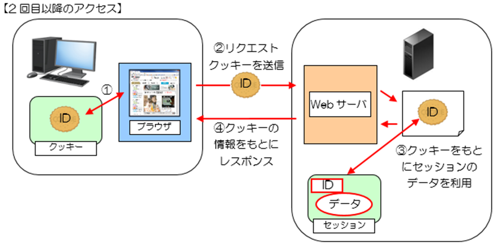
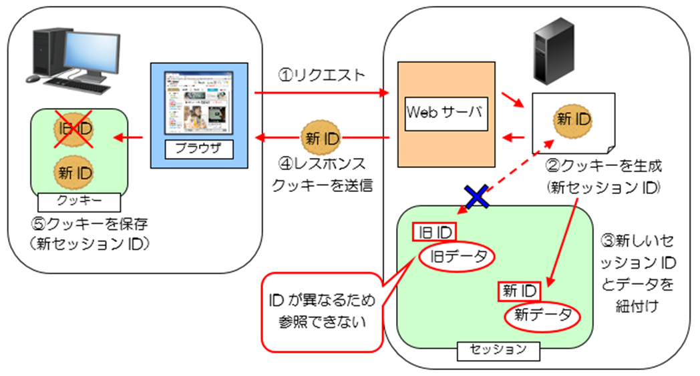
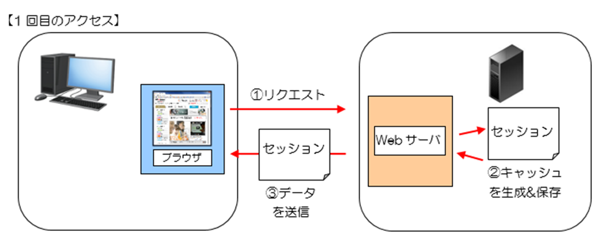
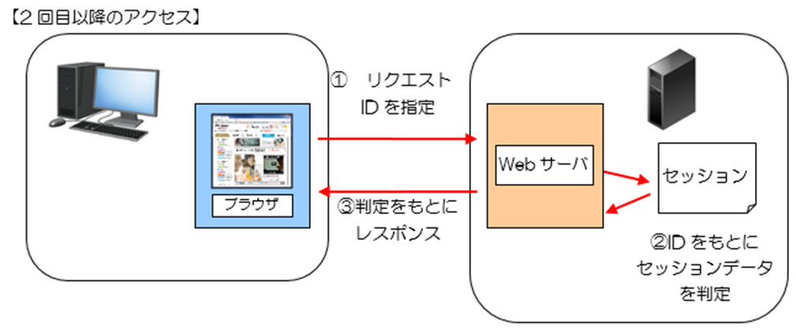

# セッション
## セッションの利用
### 1.1 データ送信とデータの共有方法
セッションを学習する上で重要になってくる、データ送信（リクエストとレスポンス）とデータの扱い方（データの共有）について知っておきましょう。

#### 1.1.1 リクエストとレスポンスの仕組み
WebサイトをWebブラウザから見る場合、必ずWebサーバへ要求「HTTPリクエスト」を出し、その要求に対する応答「HTTPレスポンス」をWebサーバがWebブラウザへ返す仕組み（HTTPプロトコル）になっています。
このHTTPプロトコルは、同じ場所（クライアント）からの再リクエストであっても、最初のリクエストと次のリクエストとの間には何の関係も持っていません。あくまでもその時の要求に対しての応答を返すだけで、前回の状態を保持できない仕組みになっています。


図 1.1.1: リクエストとレスポンスの仕組み

そのため、ページ間でデータを共有するためには様々な工夫が必要になります。例えば、隠しフィールド（inputタグのtype属性hidden）を使って、引き継ぎたいデータを保持する方法や、ファイルへ書き出して保持する方法があります。
しかし、これらの方法では、扱うデータの数やページ数が多くなってきた場合に、前者は記述するコードが多岐に渡るため煩雑になり、後者はファイル操作を行うため応答時間が遅くなるという問題が出てきます。
これらの代わりに登場する技術が、「セッション」になります。両者どちらもデータを保存しておけば、ページ間の共有データとして扱えるようになります。

#### 1.1.2 データの共有方法について
前項で簡単に説明しましたが、データをページ間で共有する方法には以下の方法があります。

##### ■データ共有方法と主な利用方法
1. 隠しフィールド（\<input type=”hidden” >）を使って共有する方法
→単一のページ間でデータを共有したい場合に利用します。

2. ファイルに保存(書き込み)して共有する方法
→主にデータベースが利用できない（しない）場合で、大量のデータを保持したい時に利用します。
※他の方法が便利で簡単に利用できるため、ページ間のデータ共有のためだけには利用しません。

3. クッキーを使って自身のパソコン内（ブラウザ毎）に保存し共有する方法
→再度Webページへアクセスされた場合や、長期間データを保持したい場合に利用します。

4. セッションを使ってサーバ内に保存し共有する方法：本章で学習
→Webページへアクセスしている間、複数ページ間でデータを共有したい場合に利用します。

5. データベース（MySQL等）を使ってデータを共有する方法
→大量のデータを関連付けて保存・管理したい場合に利用します。※②同様ページ間のデータ共有のためだけには利用しません。

1～５の方法でデータ共有方法について、まとめたものを以下表に示します。


表 1.1.1：データ共有方法のまとめ
 
上記の表からも確認できるようにそれぞれ特性が異なるため、利用する状況に応じて使い分ける必要があります。まだ学習していない方法についてはこれから紹介していきますので、現段階では各共有方法について軽くイメージしておく程度で構いません。
それでは、セッションの仕組みとその利用方法について詳しく紹介していきます。

##### ■Cookie(クッキー)とは
サーバサイドからクライアントに対して書き込める小さなテキストのことを指し、クライアント側のWebブラウザに名前と値を紐づける形でデータが保存されます。

### 1.2 セッションの仕組みを理解しよう
セッション(Session)の仕組みについて学習していきましょう。セッションは大量のデータを一時的に保存するには向いています。

#### 1.2.1 セッションについて
セッションを簡単に説明すると「サーバ内に情報を保存し、複数ページ間で共有する」仕組みのことです。
例えば、ショッピングサイトで利用されるカート機能などは、複数の商品ページを遷移し、カートに追加した各商品の情報をずっと保持している必要があります。
このような場合にセッションにデータを登録することで、他の画面に遷移してもデータを取り出し利用することができるのです。セッションでは下の図のようにデータを共有することができます。


図 1.2.1: セッションでデータ共有の流れ

また、セッションの特徴をまとめると以下になります。
1.	セッション情報はサーバ内に保存される。
2.	保存された情報はブラウザ単位で管理される。
3.	セッションの有効期限は固定されている。（ブラウザを閉じるまで、設定ファイルで決められた時間）
4.	セッションに格納する情報は、プログラムのデータ形式（文字、数値、配列…）のまま保存できる。
5.	セッションに保存できるデータ量と個数にほぼ限界はない。（最大はディスク容量まで）
6.	セッション情報がどのクライアントの情報なのかを関連づける仕組みは、クッキーに登録したセッションIDまたはキャッシュなどで管理している。※この仕組みは次の項で詳しく説明します。

##### ■Cache(キャッシュ)とは
訪問した際に「ウェブページの情報」が一時的にWebブラウザに保存される仕組みです。CookieはIDに紐づけられる形でデータが登録されるが、キャッシュではテキスト情報だけでなく画像などの情報も一時的に保存されます。

#### 1.2.2 セッションを管理する仕組み
クッキーを利用する場合
多くのWebアプリケーションではセッションを利用すると、自動的にセッションIDと呼ばれる一意のIDが発行されます。このセッションIDはセッションに登録されたデータに紐付けられるとともに、クッキーに保存されます。
セッションIDが登録されたブラウザは、Webアプリケーションにアクセスする際にセッションIDを送信するため、サーバ側ではこのIDを確認することで一連のアクセスであることが認識できるようになります。
登録したIDは、「PHPSESSID」という名前のクッキーとして登録されます。自動的にクッキーに登録された「PHPSESSID」がセッションIDを保持しています。
セッションIDをクッキーで保存しているため、Webブラウザでクッキー設定を無効にされるとセッションも利用できなくなるので注意が必要になります。
 

図 1.2.2:クッキーに登録されたセッションID

このクッキーに登録されたセッションIDとサーバ上のセッションデータの関係は次のようになります。
まず、プログラムにアクセスしセッションを利用するとセッションIDが生成され、最初の画面の表示と同時にクッキーに登録されます。その際、サーバ上のセッションのデータにも同じセッションIDが紐付けられます。


図 1.2.3: セッションIDをクッキーへ登録

2回目以降のアクセス時には、リクエストと一緒にサーバに送信されたクッキー(セッションID)をもとに、セッションのデータを参照することができます。


図 1.2.4: セッションデータの参照

クッキーに登録されたセッションIDの有効期限は、ブラウザを閉じるまでか設定ファイルで定められた時間までです。そのため、ブラウザが閉じられた(セッションが切れた)後のアクセスでは、クッキー内のセッションIDは無効となり、Webアプリケーションから新しいセッションIDが発行されます。そのため、古いセッションIDのデータは参照できなくなります。


図 1.2.5: ブラウザを閉じて再アクセス

##### ■ 同じブラウザを複数起動している場合の注意
同じブラウザを複数起動している場合、セッションIDが共有されるため、ブラウザを1つ閉じただけではセッションが切れない場合があります。セッションを切って再アクセスが必要な場合は、同じブラウザを全て閉じてから再アクセスしましょう。

##### キャッシュを利用する場合
またアプリケーションによってはキャッシュの仕組みを利用して、セッションデータを登録することもできます。
キャッシュはクッキーに似ていますが、IDに紐づけてられたデータが登録されるというよりは、サーバへ要求したデータをそのまま、クライアント(Webブラウザ)に保存されるか、またはサーバにキャッシュ用のデータとして保存されます。
キャッシュを介してセッションデータを登録した場合、再度データの生成することなくサーバから取得できます。
セッションデータにはセッションIDも含まれているため、サーバ側でPythonのプログラムを介して該当のIDと紐づける形でデータを取得できます。
 

図 1.2.6: セッションをキャッシュへ登録

2回目以降のアクセス時には、リクエストとセッションIDを指定することでサーバに保存されたセッションデータをIDに紐づける形で取得できます。


図 1.2.7: セッションデータの参照

#### 1.2.3 セッション利用の準備をする
まずセッションをプログラムで扱う場合、「settings.py」を以下の内容に従って編集します。

##### ■ リスト変数、INSTALLED_APPSに既定の要素を追加する

```
INSTALLED_APPS = [
    'django.contrib.admin',
    'django.contrib.auth',
    'django.contrib.contenttypes',
    'django.contrib.sessions', #
    'django.contrib.messages',
    'django.contrib.staticfiles',
    'psys',
]
```

##### ■ リスト変数、MIDDLEWAREに既定の要素を追加する

```
MIDDLEWARE = [
    'django.middleware.security.SecurityMiddleware',
    'django.contrib.sessions.middleware.SessionMiddleware', #
    'django.middleware.common.CommonMiddleware',
    'django.middleware.csrf.CsrfViewMiddleware',
    'django.contrib.auth.middleware.AuthenticationMiddleware',
    'django.contrib.messages.middleware.MessageMiddleware',
    'django.middleware.clickjacking.XFrameOptionsMiddleware',
]
```

##### ■ 保存方法を指定する
保存方法を指定するために以下のどれかの一文を任意の箇所に記載します。
SESSION_ENGINE = "django.contrib.sessions.backends.cache" #キャッシュで保存
SESSION_ENGINE = "django.contrib.sessions.backends.file" #ファイルで保存
SESSION_FILE_PATH = “ファイルのパス” #ファイルで保存する
SESSION_ENGINE = "django.contrib.sessions.backends.signed_cookies" #クッキーで保存

下記はキャッシュで保存、3600秒（60分）に設定
SESSION_ENGINE = 'django.contrib.sessions.backends.cache'
SESSION_COOKIE_AGE = 3600

#### 1.2.4 セッションを利用してみよう
セッションをプログラムで扱いたい場合、HttpRequestクラスのインスタンス変数requestのsessionメソッドを利用すれば行えるようになっています。

##### ■セッションへ保存と取得
HttpRequestクラスのインスタンス変数requestを利用して、キー文字列は任意で設定します。
書式
request.session[キー文字列] = 値  #セッションへ保存
request.session[キー文字列]      #セッションから取得

記載例
request.session['name'] = "山田タロウ"  #山田タロウを保存

name = request.session['name']  #セッションからキー文字列を指定して取得

セッションへはプログラム内で扱えるデータ形式なら、なんでも保存することが可能になっています。データ形式がそのままなので、他のページでそのデータを扱う場合セッションから取り出して直ぐにプログラムで使えるため大変便利になっています。

##### ■セッション情報は保存後直ぐに使える
セッションは保存処理を行ったリクエスト時からでも保存した情報を直ぐ利用することができます。セッション情報は複数のページ間で利用することを前提としていますが、自身の処理内で利用しても構いません。

##### ■セッションの存在判定
HttpRequestクラスのインスタンス変数requestを利用して、キー文字列は任意で設定します。
書式
if キー文字列 in request.session:
記載例
#nameの存在判定を行う
if “name” in request.session:

##### ■セッションの削除
書式
del request.session['キー文字列] #特定のキーのセッションを削除する
request.session.clear() #セッションをクリアにする

記載例
#nameのセッションを削除する
del request.session['name']

### 1.4.1 login_check関数
まず「views.py」に新しく作成した既にログインが実施されたかを確認する「login_check関数」について確認していきましょう。

```python:psys/views.py
def login_check(request):
    #ログイン確認
    if 'employee' in request.session:
        employee = request.session['employee']
        return employee
    else:
        return None
```

条件分岐が記載されており、条件文では「if ‘employee’ in request.session」となっています。
これは登録されたセッションデータの中に特定のキー文字列(‘employee’)が含まれていることを確認するためのものです。後ほど後述しますがキー文字列(‘employee’)には、正しいログイン情報でログインした場合にログイン情報(ログインIDとパスワード)を格納します。
つまりはログインしたかどうかによって、処理の内容が変わります。
ではログインされた場合(true)の処理を確認しましょう。trueだった場合、「request.session[‘employee’]」が代入された変数employeeが戻り値に返されます。

    employee = request.session['employee']
    return employee

反対にログインされていなかった場合(false)の処理は、戻り値として「None」が返されます。

    else:
        return None

「login_check関数」は、既にログインされたかどうかを確認するためのメソッドです。具体的には戻り値の内容が「None」かどうかを元に確認し、他の関数(View)では既にログインされたかどうかを、こちらの関数を使って確認します。
ログインされていた場合、通常の処理を実施し、そうでなかった場合、ログイン画面に遷移させるためです。

#### 1.4.2 ログイン機能
続いてログイン処理がどのように行われているのかを確認しましょう。

urls.py
最初に「psys」ディレクトリの「urls.py」を確認すると、「http://localhost:8000/psys/login」にアクセスすると「Login」に該当する要素として、「Login関数」が実行されることがわかります。

```python:psys/urls.py（抜粋）
urlpatterns = [
    path('', views.index, name='index'),
    path('Login', views.Login, name='Login'),
    path('Logout', views.Logout, name='Logout'),
    path('MainMenu', views.MainMenu, name='MainMenu'),
    path('CustomerManagementMenu', views.CustomerManagementMenu, name='CustomerManagementMenu'),
    path('CustomerList', views.CustomerList, name='CustomerList'),
    path('CustomerSearch', views.CustomerSearch, name='CustomerSearch'),
    path('CustomerDelete', views.CustomerDelete, name='CustomerDelete'),
    path('CustomerDeleteResult/<str:code>', views.CustomerDeleteResult, name='CustomerDeleteResult'),
    path('CustomerUpdate', views.CustomerUpdate, name='CustomerUpdate'),
    path('CustomerUpdateResult', views.CustomerUpdateResult, name='CustomerUpdateResult'),
    path('CustomerRegist', views.CustomerRegist, name='CustomerRegist'),
]
```

View（view.py）
「http://localhost:8000/psys / Login」にアクセスすると、「Login関数」が実行されることがわかりました。
続いてViewに該当する、Login関数の処理を確認していきましょう。

```python:psys/views.py
def Login(request):
    params = {
    'title':"Login",
    'sub_title':"ログイン",
    }

    #ログインチェック
    employee = login_check(request)
    if employee != None:        
        return redirect(to='/psys/MainMenu')
    
    if (request.method == 'POST'):
        employee_no = request.POST['employee_no']
        password = request.POST['password']
        
        try:
            employee = Employee.objects.get(employee_no=employee_no, password=password)
        #セッションの登録
            request.session['employee'] = employee
            return redirect('MainMenu')
        except:
            messages.error(request,"従業員番号またはパスワードが間違っています。")
            return redirect(‘/Login')
        
    return render(request, 'psys/Login.html',params)
```

まず#ログインチェックでは、既にログインが実施されているのかを確認を行っています。「employee = login_check(request)」では、先ほどのlogin_check関数が呼び出されているので、変数employeeには、Noneまたはキー「’employee’」に紐づくデータが格納されています。

    #ログインチェック
    employee = login_check(request)
    if employee != None:        
        return redirect('MainMenu')

変数employeeの値がNoneではなかった場合、「http://localhost:8000//psys/MainMenu」へリダイレクトされることがわかります。
つまりは既にログインされている場合は、ログイン処理が不要ですのでリダイレクトされます。
次に条件分岐が実施されています。「if (request.method == ‘POST’):」からPOST送信が行われたか(※ユーザーがログイン情報を入力し、ログインをクリックしたか)どうかで、処理の内容が変わる条件分岐です。

```python
    if (request.method == 'POST'):
        employee_no = request.POST['employee_no']
        password = request.POST['password']
        
        #セッションの登録
        try:
            employee = Employee.objects.get(employee_no=employee_no, password=password)
            request.session['employee'] = employee
            return redirect('MainMenu')
        except:
            messages.error(request,"従業員番号またはパスワードが間違っています。")
            return redirect('Login')
        
    return render(request, 'psys/Login.html',params)
```

POST送信(サインイン)が行われなかった場合、「Login.html」の画面(ログイン画面)が表示されることがわかります。
    return render(request, 'psys/Login.html',params)
またPOST送信(サインイン)が行われた場合の処理を確認すると、入力情報を受け取るために変数employee_noと変数passwordで送信データを受け取っています。

    employee_no = request.POST['employee_no']
    password = request.POST['password']

さらにログイン情報が正しいかどうかを確認するための条件分岐が実施されます。「objects.get(引数名=値)メソッド」で、ログイン画面で入力した情報が、実際にEmployeeテーブルに登録されているかどうかを判断することができます。

```
#セッションの登録
try:
    employee = Employee.objects.get(employee_no=employee_no, password=password)
    request.session['employee'] = employee
    return redirect('MainMenu')
```

変数employeeは、キー「’employee’」としてセッションに保存されます。これはログイン処理が行われた事実を残すためのもので、セッションが有効の間は、login_Check関数を介してログインに必要な手続きを省くことができます。
無事ログイン処理が完了し、ログイン情報も登録できたので、「http://localhost:8000/psys/MainMenu」へリダイレクトさせます。
では、反対にログイン情報が間違っていた場合の処理を確認していきましょう。

```
except:
    messages.error(request,"従業員番号またはパスワードが間違っています。")
    return redirect('Login')
```

ログイン情報が間違っていた場合、テンプレート(「login.html」)に渡す「message」の内容を「” 従業員番号またはパスワードが間違っています。”」に変更します。
その上で、「Login.html」の画面に遷移させるため、ログイン情報を間違えると「” 従業員番号またはパスワードが間違っています。”」と表示されたログイン画面が表示されます。


#### 1.4.3 管理メニュー機能(MainMenu関数)、管理メニュー画面(MainMenu.html)

続いて一覧機能と一覧画面の変更点について確認していきましょう。

管理メニュー機能（MainMenu関数）
まずMainMenu関数の内容から確認していきます。

```python:psys/views.py
def MainMenu(request):
    #ログインチェック
    employee = login_check(request)
    if employee == None:
        messages.error(request,"ログインしてください。")
        return redirect('Login')

    params = {
        'title':"MainMenu",
        'sub_title':"管理メニュー",
        'employee':employee
    }

    if 'CustomerManagementMenu' in request.POST:
        return redirect('CustomerManagementMenu')

    if 'Customer' in request.POST:
        return redirect('MainMenu')

    return render(request, 'psys/MainMenu.html',params)
```

主な変更点は既にログインされたかどうかを確認するための処理が追加されている点です。

```
#ログインチェック
employee = login_check(request)
if employee == None:
    messages.error(request,"ログインしてください。")
    return redirect('Login')
```

変数employeeにlogin_check関数の戻り値を返しています。変数employeeは既にログインがされていた場合は、Employeeクラスのインスタンス、そうでなかった場合はNoneが格納されます。
ログインされていなかった場合、Loginページに遷移させたいため、employeeの中身がNoneだった(既にログインされていなかった)場合、「http://localhost:8000/psys/Login」へリダイレクトします。

管理メニュー画面(MainMenu.html）
続いて一覧画面「MainMenu.html」の変更点を確認しましょう。

```html:MainMenu.html（抜粋）
<div id="contents">
    <div id="navi">
        <ul>
            <li><a href="">ログアウト</a></li>
        </ul>
    </div>

    <div id="main_contents">
        <div id="form">
            <form action="" method="POST">
                
                <ul>
                    <li><input type="submit" value="得意先管理" name="CustomerManagementMenu" class="btn"></li>
                    <li><input type="submit" value="得意先別集計" name="Customer" class="btn"></li>
                </ul>
            </form>
        </div>
        <div id="table">

        </div>
        <div id="message">
            <ul>
                
                <li>{{ message }}</li>
                
            </ul>    
        </div>
    </div><!-- /main_contents -->
</div><!-- /contents -->
```

主な変更点はメニュー一覧に「ログアウト」のリンクを変更した点です。

```
<ul>
    <li><a href="">ログアウト</a></li>
</ul>
```

【ログアウト】をクリックすると、「http://localhost:8000/psys/Logout」へ移動します。変更前はLogin画面へのリンクでした。
「http://localhost:8000/psys/Logout」へアクセスするとログアウトできるような処理が行われます。
次の節でどのようにログアウト処理が実装されているのかを確認しましょう。

#### 1.4.4 ログアウト機能
ではログアウト機能の実装方法について以下で解説します。

urls.py
まずurls.pyを確認すると「http://localhost:8000/psys/Logout」にアクセスすると「Logout」に該当する要素として、「Logout関数」が実行されることがわかります。

```python:psys/urls.py（抜粋）
path('Logout', views.Logout, name='Logout'),
```

View（view.py）
続いて「http://localhost:8000/psys/Logout」にアクセスした場合に実行されるLogout関数の処理を確認していきましょう。

```python:psys/views.py】
def Logout(request):
    if 'employee' in request.session:
        del request.session['employee']

    return redirect('Login')
```

if文が実行されています。「if 'employee' in request.session:」はキー「’employee’」に該当するセッションデータの有無、つまりは既にログインが行われているかどうかを確認するためのものです。

    if 'employee' in request.session:

そしてログインが行われていた場合(true)、102行目でキー「'employee'」に該当するセッションデータが削除されるのです。

    del request.session['employee']

最後に「http://localhost:8000/psys/Login」へリダイレクトされます。

    return redirect('Login')

